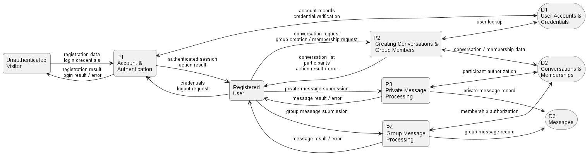
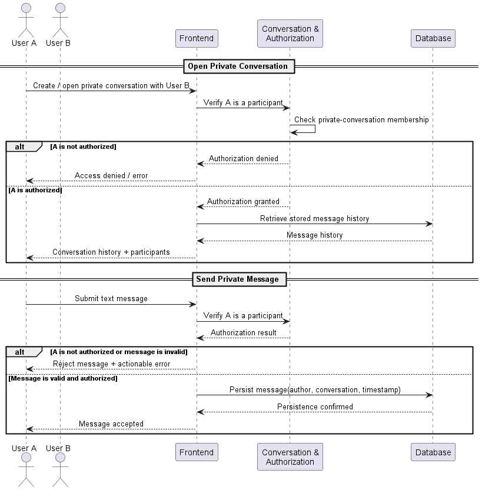

# Diagrams and Analysis

## Thomas Crossman

### Data flow diagram

The dataflow diagram seeks to visualize where data comes from, what happens to it, and where does it go. The diagram seperates the messenger app into account/authentication, dealing with conversation creation and membership, and private and group messages. The database is split up into three tables, represented in the diagram. 

* Account/authentication: FR-01, 02, 03, 04, 05, 17, NFR-01, 02. 
* Creating conversations and group members: FR-06, 08, 10, 11, 12, 14, 16, NFR 3.
* Private message processing: FR-07
* Group message processing: FR-09

The flow chart shows that authorization has to occur before any conversation or messages are able to be viewed. This is an important characterization of the system because this gate must occur at the beginning of the user's visit to the site. It also exposes how messages can't just be sent client to client, they need to be sent to the database and stored there with the sender and timestamp. Additionally, if both private and group messages are stored in the same place, then they need to have a distinction so the server knows how to handle incomming messages. 

### Sequence digram

The sequence diagram shows the interaction of the different components over time. It shows who is involved and in what order do the processes occur to make the request fulfilled. For example, when a user becomes authorized, they receive an authroization granted message and request their chat history. This is given to them an dthey can start sending messages. This process is laid out visaully in the sequence diagram. 

* Create a private conversation: FR-03, 06. 

* Send private messages: FR-03, 07. 

The diagram explsoes a question about how up to date the site is. Should a user be able to immediately see a message that is sent or would they need to refesh the page to get the new message? This question does not require much thought from a usability perspective as it is a much better user expierence if messages just populate naturally. 